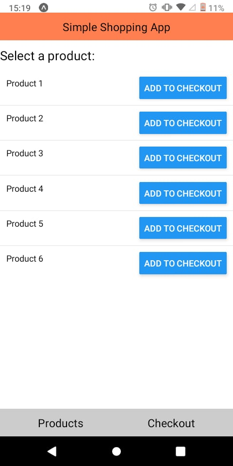
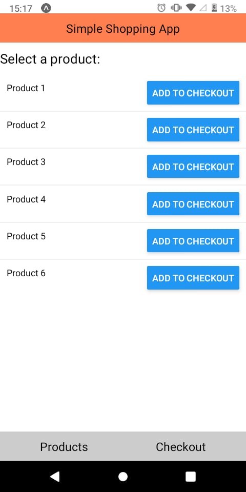
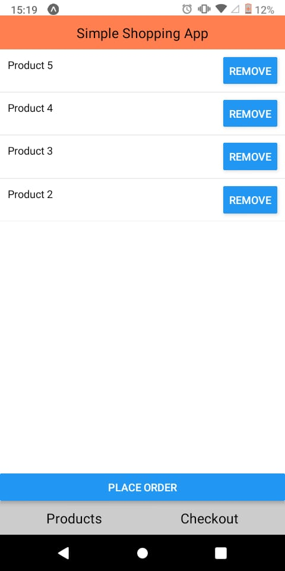
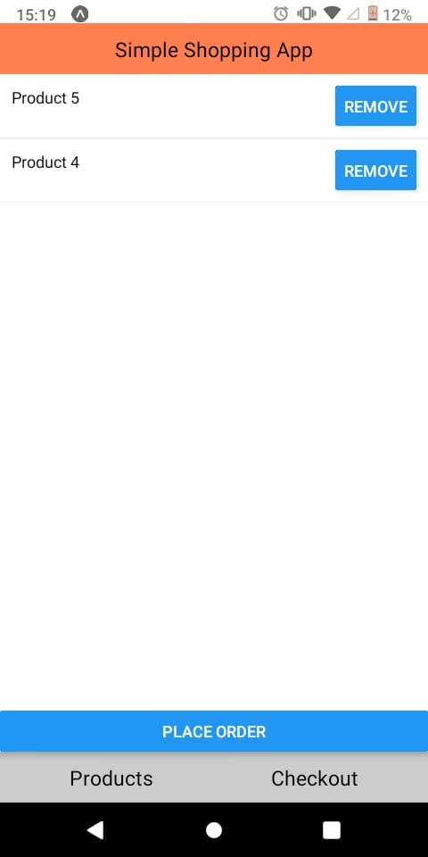
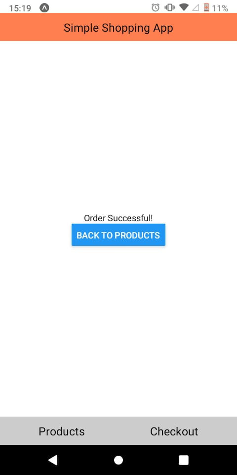

Project Title: Simple Shopping App

Description: A simple shopping app demonstrating basic functionalities of a shopping cart.

Setup Instructions:

1.Clone the repository.
2.Navigate to the project directory.
3.Install dependencies with npm install.
4.Start the development server with expo start.

App Screenshots:

## Appetize.io Demo

You can interactively preview our app using Appetize.io. Click the link below to launch the demo:

[Launch the Appetize.io Demo](https://appetize.io/app/4d66oiuprt7f2wjhfdnkvyi6tu?device=pixel7&osVersion=13.0)

Features

List of products/items
Checkout screen with add/remove functionality
Order successful screen
Bottom navigation bar

License
This project is licensed under the MIT License.